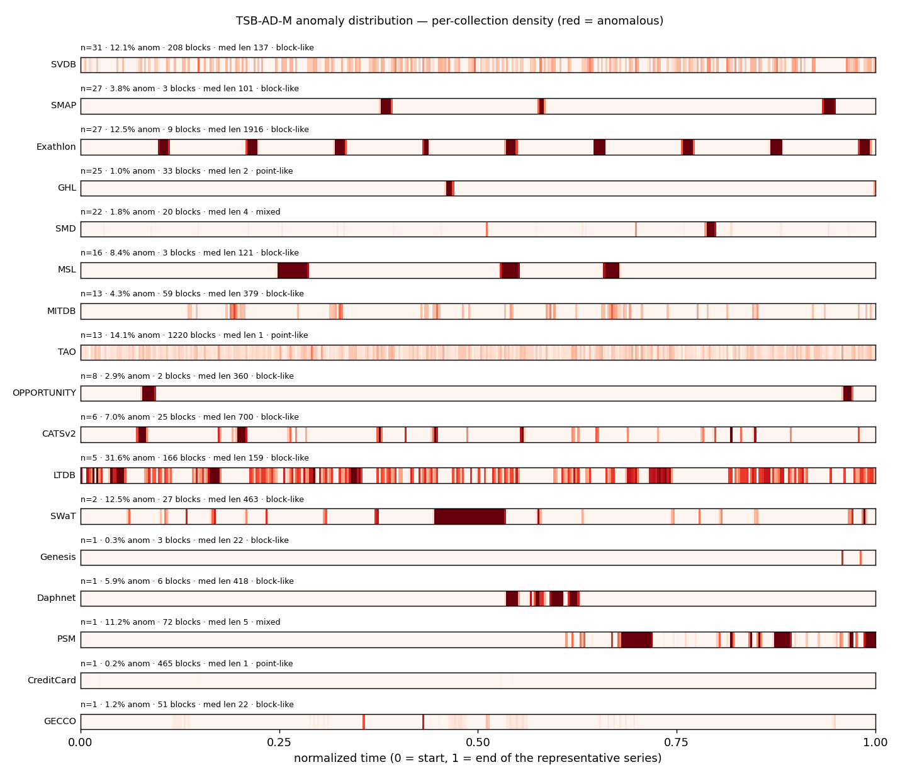

# TSB-AD-M anomaly structure (full corpus)

All 200 series across 17 collections in `/ocean/projects/cis260190p/yhwang2/data/TSB-AD-M/TSB-AD-M/`, by anomaly shape. Generated by `experiments/proposals/label_stats.py --all-files`. Per-series detail in `dataset_anomaly_structure.csv`.

`shape`: **point-like** = median anomaly run ≤ 2 (isolated points); **block-like** = median run ≥ 20 (contiguous segments); **mixed** in between. This distinguishes point-anomaly datasets (creditcard) from contiguous-block datasets (gecco/SMAP/MITDB) — the RW-CEGAR 'erase' failure mode bites hardest on long blocks the gate can localize.

## Per-collection summary

`★` = the representative series used in the P1/P2 experiments.

| collection | ★ | n series | total rows | anomaly % (mean / min–max) | median block len | max block | dominant shape |
|---|:-:|:-:|:-:|:-:|:-:|:-:|---|
| SVDB |  | 31 | 6,420,800 | 4.87% (0.45–12.06) | 147 | 7,000 | block-like (block-like:31) |
| Exathlon |  | 27 | 1,643,718 | 9.83% (6.28–12.62) | 982 | 1,961 | block-like (block-like:27) |
| SMAP | ★ | 27 | 212,109 | 2.94% (0.41–13.66) | 101 | 1,121 | block-like (block-like:27) |
| GHL |  | 25 | 4,919,718 | 1.15% (0.49–3.25) | 1009 | 1,863 | block-like (block-like:24, point-like:1) |
| SMD | ★ | 22 | 560,260 | 3.81% (0.42–11.95) | 40 | 1,215 | block-like (block-like:16, mixed:6) |
| MSL |  | 16 | 49,910 | 5.11% (0.60–13.07) | 112 | 301 | block-like (block-like:15, mixed:1) |
| MITDB | ★ | 13 | 4,370,000 | 2.77% (0.16–12.41) | 433 | 18,610 | block-like (block-like:13) |
| TAO |  | 13 | 130,000 | 8.77% (4.83–14.09) | 1 | 5 | point-like (point-like:13) |
| OPPORTUNITY | ★ | 8 | 139,414 | 4.12% (1.18–9.09) | 385 | 621 | block-like (block-like:8) |
| CATSv2 |  | 6 | 1,440,000 | 3.72% (2.00–7.00) | 500 | 5,000 | block-like (block-like:6) |
| LTDB |  | 5 | 500,000 | 15.57% (0.51–31.56) | 116 | 1,559 | block-like (block-like:5) |
| SWaT |  | 2 | 414,915 | 12.89% (12.53–13.24) | 358 | 35,900 | block-like (block-like:2) |
| CreditCard | ★ | 1 | 284,807 | 0.17% (0.17–0.17) | 1 | 5 | point-like (point-like:1) |
| PSM |  | 1 | 217,624 | 11.20% (11.20–11.20) | 5 | 8,861 | mixed (mixed:1) |
| Genesis |  | 1 | 16,220 | 0.31% (0.31–0.31) | 22 | 26 | block-like (block-like:1) |
| GECCO | ★ | 1 | 138,521 | 1.25% (1.25–1.25) | 22 | 253 | block-like (block-like:1) |
| Daphnet |  | 1 | 38,774 | 5.95% (5.95–5.95) | 418 | 664 | block-like (block-like:1) |

## Anomaly distribution (timelines)

Where the anomalies sit across time, for the most-fragmented (most blocks) representative series of each collection (red = anomaly span). This shows the distribution pattern behind the shape label above: a few long red bands (block-like: gecco/SMAP/MITDB) vs many thin scattered ticks (point-like: creditcard/TAO).

