# Proposal 1 — Residual-Gated RW-CEGAR: Results

**Verdict: P1 does not beat the best-HP/200ep RW-1 (0/3 on the verdict set; near-tie on
OPPORTUNITY, close on GECCO). The old "clear loss" was largely a config artifact.**

## What Proposal 1 is
Simplest CEGAR × RW-ML hybrid; overrides only the signals: wrongness
`E_t = σ(k·(robust_z − τ))`, `robust_z = (r − median)/MAD`; confidence `C_t = 1` (basic);
gate `g = E_t·C_t`, scale `s = 1+λg` on the per-window forecasting-loss gradient (ScaleGrad).
Score = `mean|correction|`.

## Experiment settings
| group | values |
|---|---|
| training | `epochs=100`, `warmup=10` (**warm-up = plain RW-1, gate OFF; gate on after**), `correction_init='neg_x'` |
| RW-1 base | `window=50`, `batch=256`, `l1_weight=0.001`, `activation=linear`, `correction_rate=0.1`, score = `mean|correction|` |
| gate | `k=1`, `τ=2`, `λ=1` (fixed) **or** `lam_mode='auto_tr'` (auto-λ column) |
| variant | `basic` (C_t = 1) |
| eval | unit = whole collection (mean over its series); **no fixed seed** (1 run/cell) |
| baseline | RW-1 / DeepAnT = reproduction per-collection means (**best-HP, 200ep**) → Δ is config-confounded on the epoch/HP axis, indicative |

## Results — all collections (AUC-PR; fixed / auto-λ)
`set`: V = verdict, E = shape-spectrum extension. **W** = fixed beats RW-1.

| collection | shape | set | n | DeepAnT* | RW-1* | P1 fixed | auto-λ | Δ (fixed−RW-1) |
|---|:-:|:-:|:-:|:--:|:--:|:--:|:--:|:--:|
| GECCO | block | V | 1 | 0.454 | 0.639 | 0.565 | 0.618 | −0.074 |
| OPPORTUNITY | block | V | 8 | 0.272 | 0.138 | 0.123 | 0.113 | −0.015 |
| CreditCard | point | V | 1 | 0.147 | 0.111 | 0.032 | 0.035 | −0.079 |
| TAO | point | E | 13 | 0.996 | 0.995 | 0.995 | 0.995 | ≈0 (tie) |
| PSM | mixed | E | 1 | 0.407 | 0.137 | 0.125 | 0.126 | −0.012 |
| MSL | block | E | 16 | 0.116 | 0.131 | 0.136 **W** | 0.118 | +0.005 |
| SWaT | block | E | 2 | 0.516 | 0.444 | 0.139 | 0.131 | −0.305 |

Beats RW-1 on **0/3** verdict; on the extension only MSL edges it (+0.005, ~noise) and TAO
ties; SWaT/PSM lose. AUC-ROC (fixed, verdict): OPPORTUNITY 0.703, GECCO 0.918, CreditCard 0.716.

## Correction diagnostics (thesis §8.4, fixed)

How to read (all computed per timestep in the FINAL training epoch, against the
ground-truth labels; labels are used for analysis only, never during training):

- **gate->label AUC**: ROC-AUC when the per-timestep gate activation is used as if it
  were an anomaly score. 0.5 = the gate fires randomly w.r.t. the true anomalies,
  1.0 = it fires exactly at them. Measures how well the gate LOCALIZES anomalies.
  (Gate activation of a timestep = mean gate value of the training windows whose
  prediction target is that timestep.)
- **corr@anom/norm**: mean |correction| on anomaly timesteps / mean |correction| on
  normal timesteps. Since the anomaly score IS mean |correction|, this is the score
  contrast: e.g. a value of 10 means anomalous points end up with 10x more correction
  than normal points (higher = better separation = higher AUC-PR, all else equal).
- **Overlap (prec)**: thesis Sec. 8.4 definition. A point is "high-correction" when its
  |correction| exceeds the series' own 95th percentile (tau_C). Overlap = fraction of
  high-correction points that are true anomalies (precision of the correction).
- **Coverage (recall)**: fraction of true anomaly points that are high-correction
  (recall of the correction; thesis Sec. 8.4 calls it AnomalyCoverage).

| collection | gate→label AUC | corr@anom/norm | Overlap (prec) | Coverage (recall) |
|---|:--:|:--:|:--:|:--:|
| GECCO | 0.896 | 11.60 | 0.194 | 0.776 |
| CreditCard | 0.951 | 1.84 | 0.011 | 0.315 |
| OPPORTUNITY | 0.480 | 1.09 | 0.126 | 0.145 |

## Interpretability
On GECCO the residual gate localizes anomalies (0.90) and correction concentrates there
(11.6×, 78% coverage) → high AUC-PR (0.565). Under the corrected config this concentration
is now *good* (score-contrast up), not the old "erase" risk. Uninformative gate on
opportunity (0.48) yet near-ties RW-1. Point anomalies (creditcard) stay weak.

## Decision
Competitive but does not beat tuned RW-1 → move to Proposal 2.


## Performance (AUC-PR by collection)

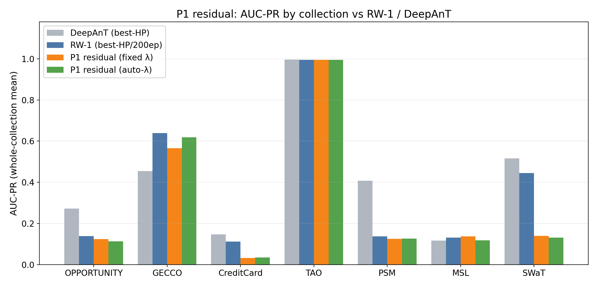

P1's residual-wrongness gate tracks RW-1 closely on GECCO (fixed just under the tuned baseline, auto-λ nearly level) but never clears it on a verdict collection; the only bars above RW-1 are the trivial (TAO) and weak-baseline (MSL) cases.

## Correction examples

**How to read these.** *Middle panel*: `original x` (blue) vs `corrected x = x + correction` (orange) — where the two diverge, the trained RW correction is large. *Bottom panel*: the CEGAR gate (green) and the per-step `|correction|` score (purple); the red band is the labelled anomaly. A detector scores well when both the gate and `|correction|` spike **inside** the red band and stay flat outside — that contrast is what the anomaly score (`mean|correction|`) turns into AUC-PR. The top strip shows where the zoom window sits in the whole series.

**Analysis.** On GECCO the correction concentrates sharply on the anomaly (≈11.6× the normal level), flattening the spike — the mechanism works, but fixed-λ contrast stays just short of the tuned RW-1. On CreditCard (point) the correction barely fires, matching its low score.

### Verdict collections

**GECCO (block) — the win**

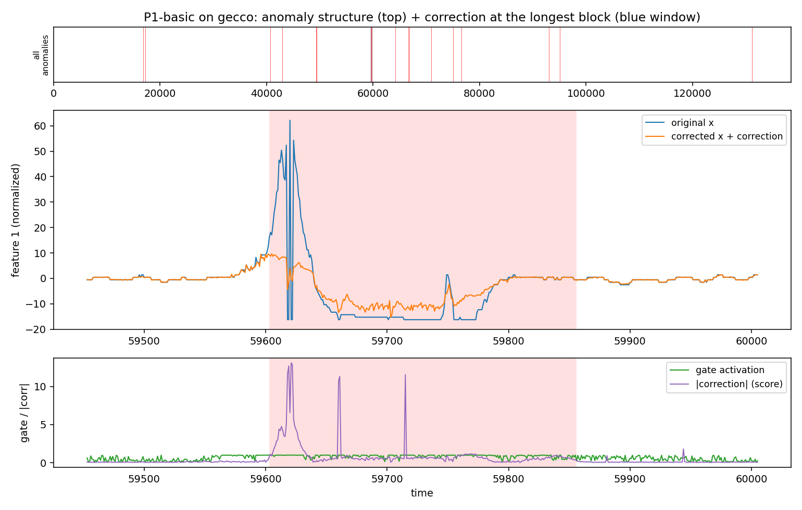

**OPPORTUNITY (block)**

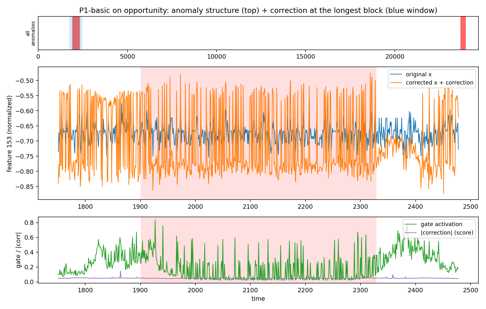

**CreditCard (point)**

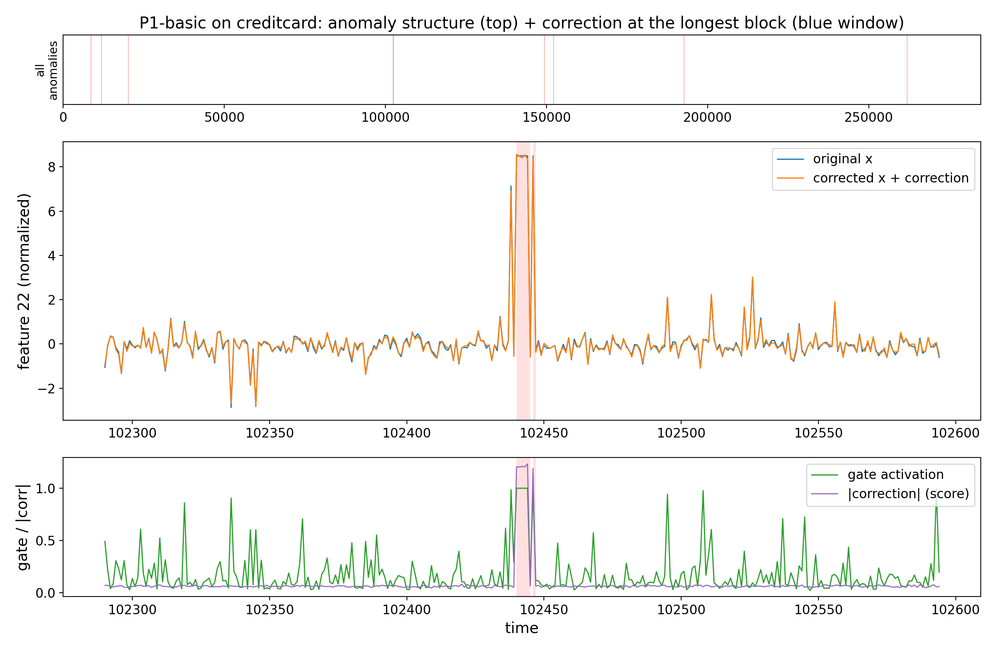

### Shape extension

**TAO (point)**

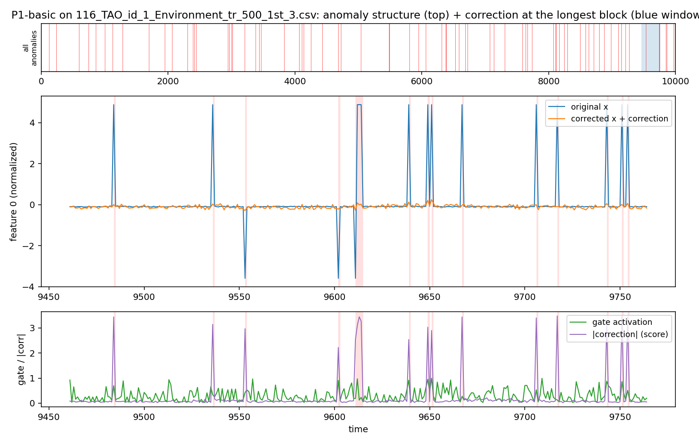

**PSM (mixed)**

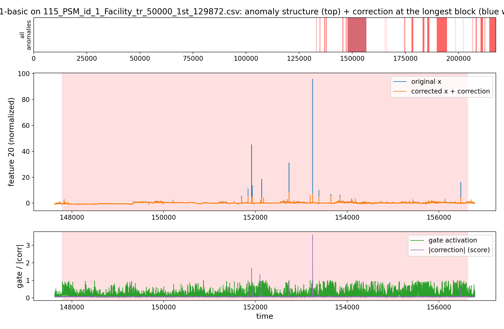

**MSL (block)**

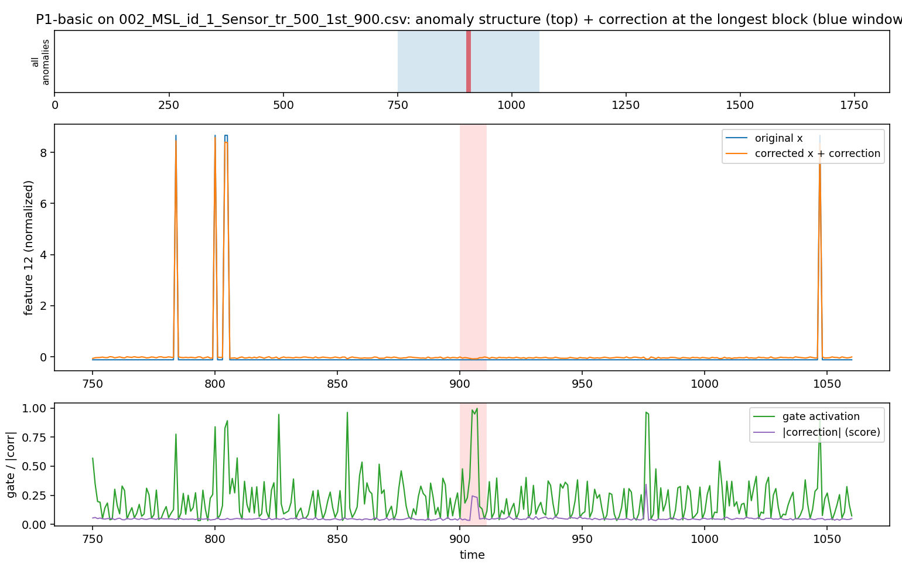

**SWaT (block)**

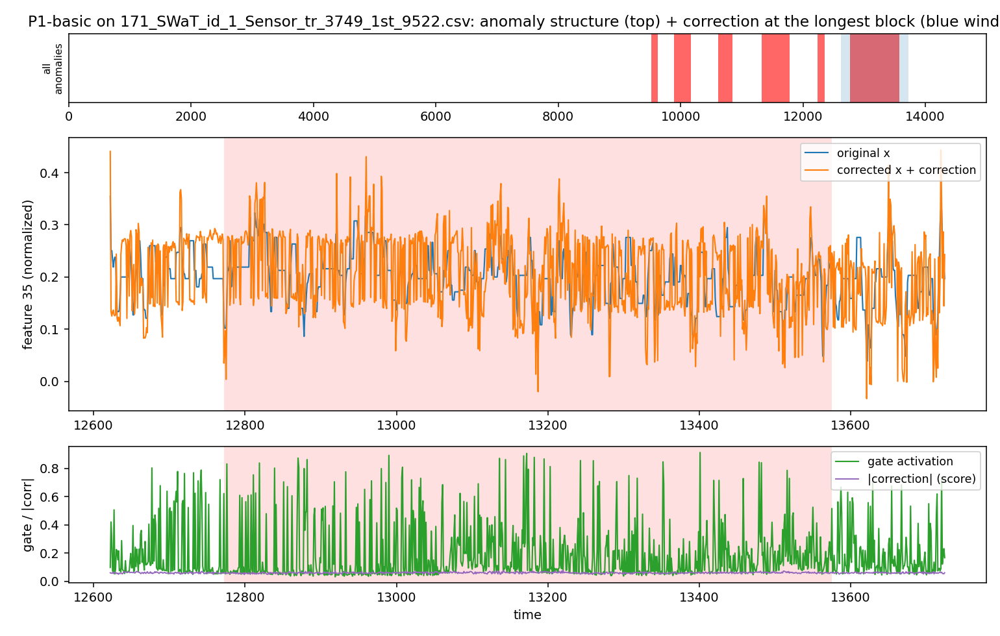

### Characterization set

**SMAP (point)**

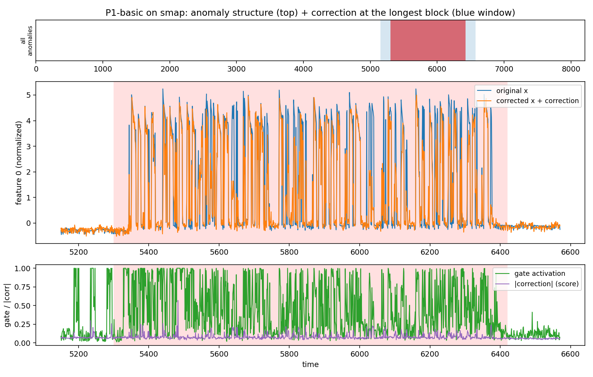

**SMD (neutral)**

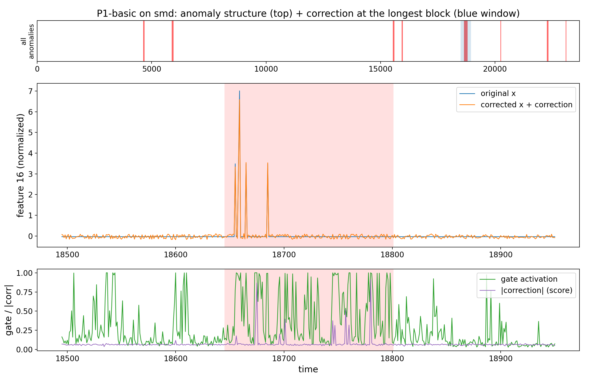

**MITDB (periodic)**

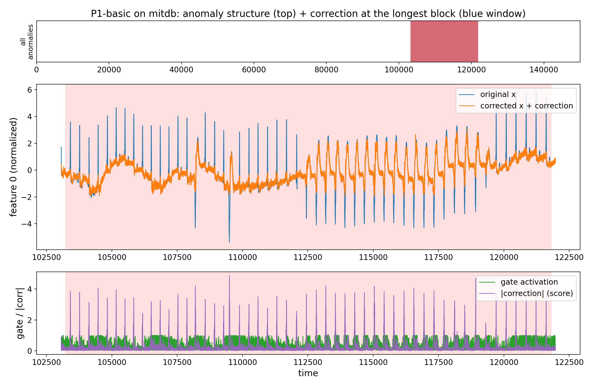

## Reproduce
```bash
source /ocean/projects/cis260190p/yhwang2/xlstmad_env/bin/activate
cd /ocean/projects/cis260190p/yhwang2/rwml-autocegar
sbatch experiments/proposals/runs/submit_p1_coll.sh
python experiments/proposals/aggregate_collection.py --proposal 1
```
