# Proposal 2 — Uncertainty-Aware Residual CEGAR: Results

**Verdict: P2 does not beat the best-HP/200ep RW-1 (0/3). Near-tie on OPPORTUNITY; well
below on GECCO (weakest gate localization of the five).**

## What Proposal 2 is (docx-faithful)
Confident error = high residual with LOW predictive uncertainty (MC-dropout, M passes):
`u_t=(1/M)Σ‖Ŷ^m−μ‖²`, `e_t=‖Y−μ‖/√(u_t+ε)`, `g=σ(k_e(e_t−τ_e))·σ(k_c(τ_u−u_t))`.
Only `_compute_signals` overridden. Score = `mean|correction|`.

## Experiment settings
| group | values |
|---|---|
| training | `epochs=100`, `warmup=10` (**plain RW-1, gate OFF; gate on after**), `correction_init='neg_x'` |
| RW-1 base | `window=50`, `batch=256`, `l1_weight=0.001`, `activation=linear`, `correction_rate=0.1` |
| gate | `k=1`, `τ=2`, `λ=1` (fixed) **or** `lam_mode='auto_tr'`; `tau_u=0` |
| variant | `mc5` (M = 5 MC-dropout passes) |
| eval | whole collection; **no fixed seed** (1 run/cell) |
| baseline | reproduction best-HP/200ep → Δ config-confounded (indicative) |

## Results — all collections (AUC-PR; fixed / auto-λ)
`set`: V = verdict, E = extension. **W** = fixed beats RW-1.

| collection | shape | set | n | DeepAnT* | RW-1* | P2 fixed | auto-λ | Δ (fixed−RW-1) |
|---|:-:|:-:|:-:|:--:|:--:|:--:|:--:|:--:|
| GECCO | block | V | 1 | 0.454 | 0.639 | 0.380 | 0.383 | −0.259 |
| OPPORTUNITY | block | V | 8 | 0.272 | 0.138 | 0.125 | 0.125 | −0.013 |
| CreditCard | point | V | 1 | 0.147 | 0.111 | 0.025 | 0.025 | −0.086 |
| TAO | point | E | 13 | 0.996 | 0.995 | 0.995 | 0.995 | ≈0 (tie) |
| PSM | mixed | E | 1 | 0.407 | 0.137 | 0.116 | 0.115 | −0.021 |
| MSL | block | E | 16 | 0.116 | 0.131 | 0.135 **W** | 0.134 **W** | +0.004 |
| SWaT | block | E | 2 | 0.516 | 0.444 | 0.133 | 0.136 | −0.311 |

Beats RW-1 on **0/3** verdict; MSL edges it (+0.004, ~noise), TAO tie, SWaT/PSM lose.
auto-λ flat (gate weak → nothing to amplify). AUC-ROC (fixed): OPP 0.708, GECCO 0.838, CC 0.605.

## Correction diagnostics (thesis §8.4, fixed)

How to read (all computed per timestep in the FINAL training epoch, against the
ground-truth labels; labels are used for analysis only, never during training):

- **gate->label AUC**: ROC-AUC when the per-timestep gate activation is used as if it
  were an anomaly score. 0.5 = the gate fires randomly w.r.t. the true anomalies,
  1.0 = it fires exactly at them. Measures how well the gate LOCALIZES anomalies.
  (Gate activation of a timestep = mean gate value of the training windows whose
  prediction target is that timestep.)
- **corr@anom/norm**: mean |correction| on anomaly timesteps / mean |correction| on
  normal timesteps. Since the anomaly score IS mean |correction|, this is the score
  contrast: e.g. a value of 10 means anomalous points end up with 10x more correction
  than normal points (higher = better separation = higher AUC-PR, all else equal).
- **Overlap (prec)**: thesis Sec. 8.4 definition. A point is "high-correction" when its
  |correction| exceeds the series' own 95th percentile (tau_C). Overlap = fraction of
  high-correction points that are true anomalies (precision of the correction).
- **Coverage (recall)**: fraction of true anomaly points that are high-correction
  (recall of the correction; thesis Sec. 8.4 calls it AnomalyCoverage).

| collection | gate→label AUC | corr@anom/norm | Overlap | Coverage |
|---|:--:|:--:|:--:|:--:|
| GECCO | 0.510 | 6.43 | 0.154 | 0.617 |
| CreditCard | 0.409 | 1.63 | 0.007 | 0.201 |
| OPPORTUNITY | 0.182 | 1.08 | 0.121 | 0.140 |

## Interpretability
The MC-dropout uncertainty gate is the weakest localizer (GECCO gate→label AUC 0.51 ≈
random), so P2 lags the residual-based proposals on GECCO. Near-ties RW-1 on opportunity.
Confirms the docx MC-dropout-miscalibration risk.

## Decision
Does not beat tuned RW-1; weakest gate → move to Proposal 3.


## Performance (AUC-PR by collection)

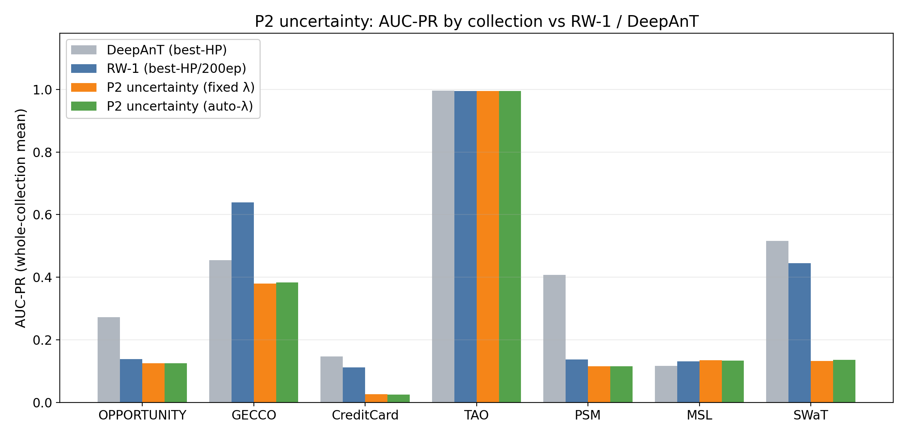

P2's MC-dropout uncertainty gate is the weakest of the five: GECCO sits far below RW-1 because the uncertainty signal barely localizes anomalies, and no verdict collection is competitive.

## Correction examples

**How to read these.** *Middle panel*: `original x` (blue) vs `corrected x = x + correction` (orange) — where the two diverge, the trained RW correction is large. *Bottom panel*: the CEGAR gate (green) and the per-step `|correction|` score (purple); the red band is the labelled anomaly. A detector scores well when both the gate and `|correction|` spike **inside** the red band and stay flat outside — that contrast is what the anomaly score (`mean|correction|`) turns into AUC-PR. The top strip shows where the zoom window sits in the whole series.

**Analysis.** The gate is driven by MC-dropout uncertainty, which on GECCO barely separates anomalies from normal (gate→label ≈0.51, near chance), so the correction is diffuse — weak, spread-out spikes rather than a tight block.

### Verdict collections

**GECCO (block) — the win**

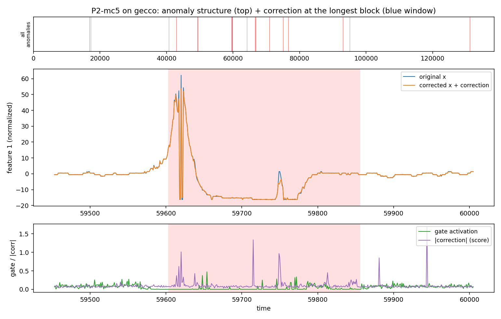

**OPPORTUNITY (block)**

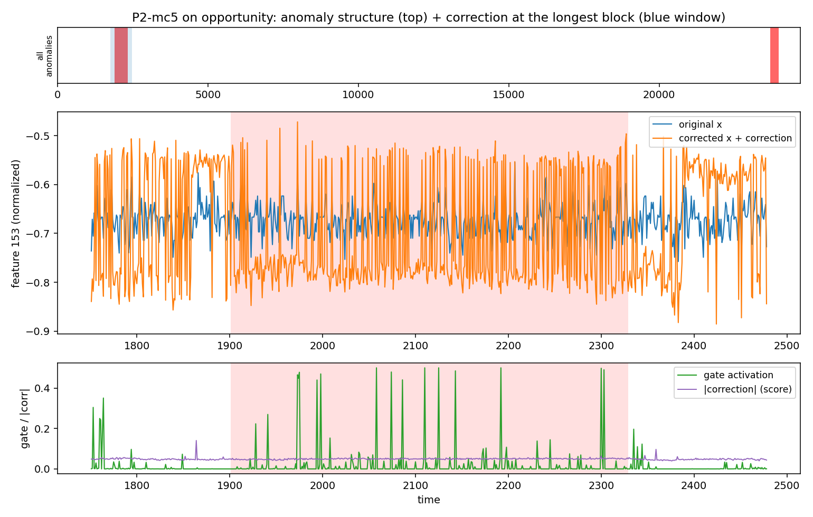

**CreditCard (point)**

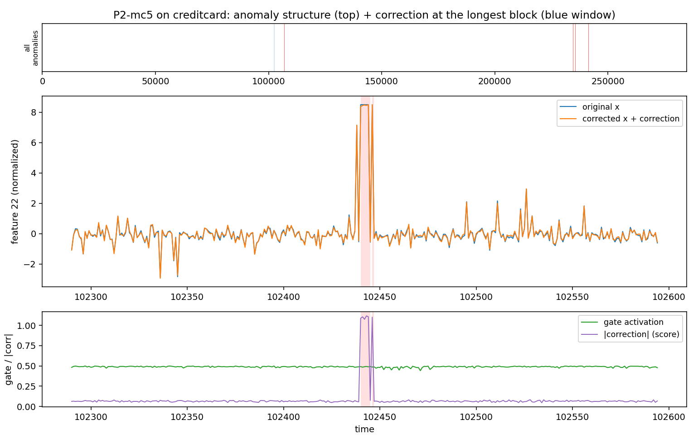

### Shape extension

**TAO (point)**

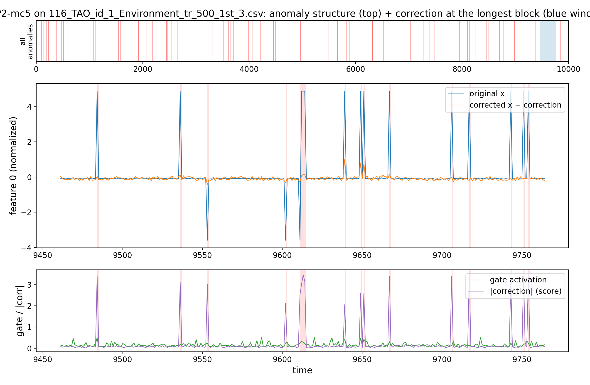

**PSM (mixed)**

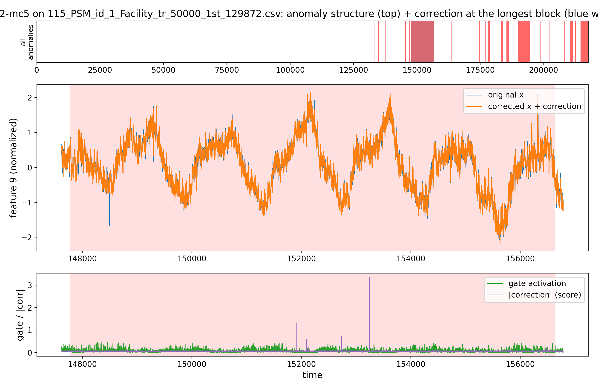

**MSL (block)**

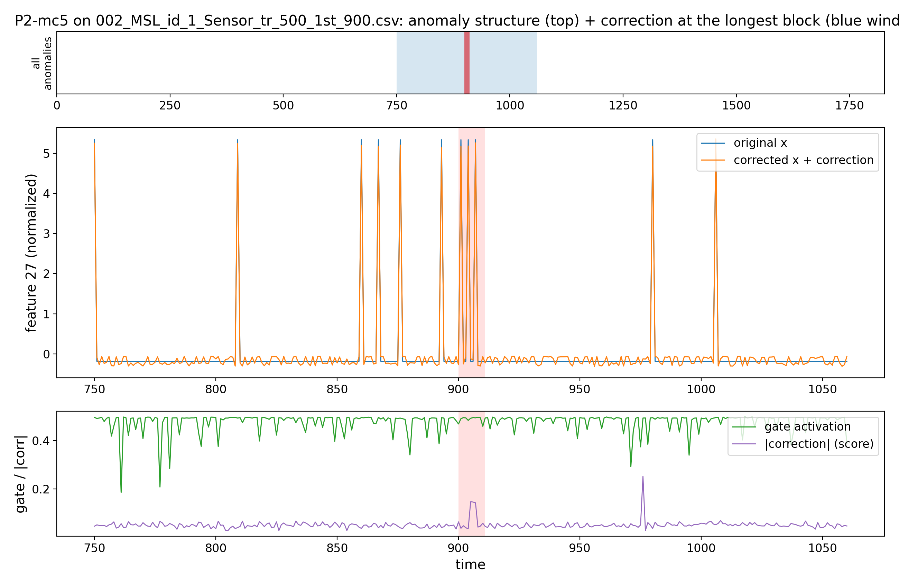

**SWaT (block)**

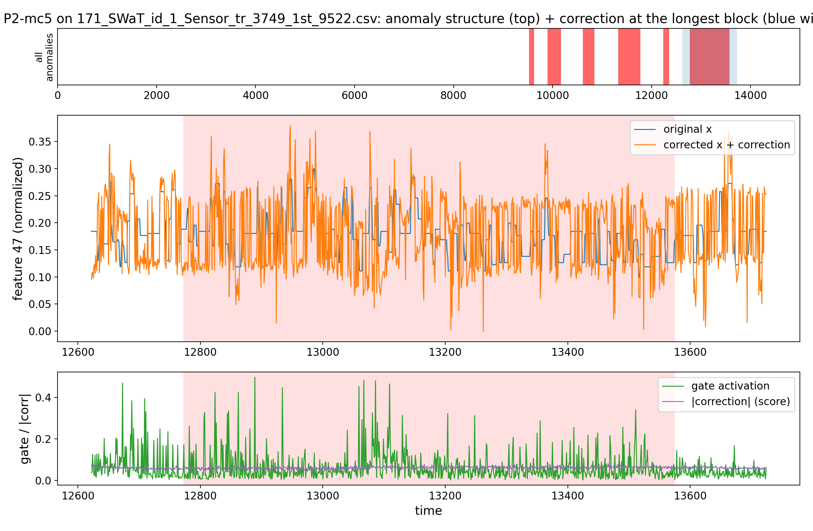

### Characterization set

**SMAP (point)**

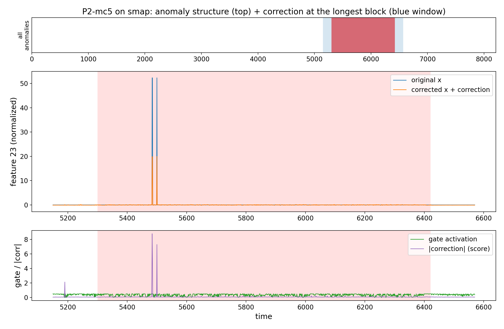

**SMD (neutral)**

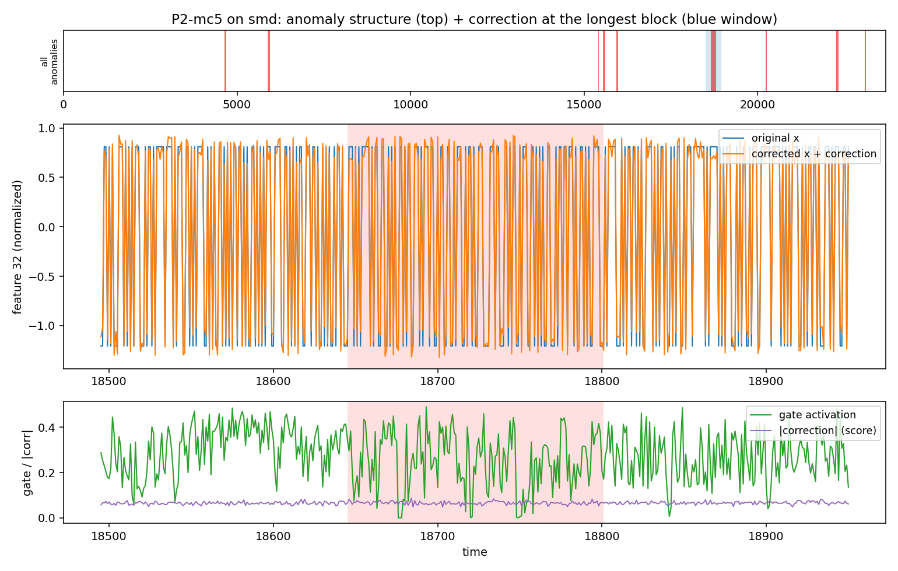

**MITDB (periodic)**

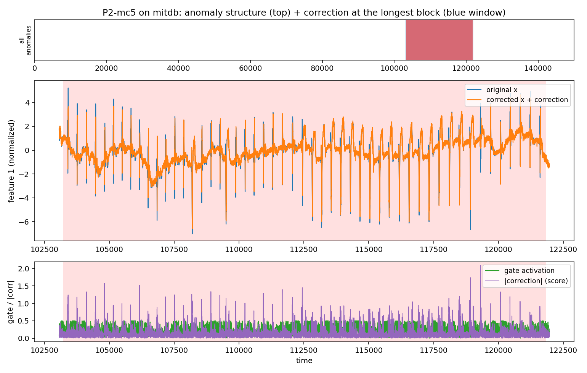

## Reproduce
```bash
source /ocean/projects/cis260190p/yhwang2/xlstmad_env/bin/activate
cd /ocean/projects/cis260190p/yhwang2/rwml-autocegar
sbatch experiments/proposals/runs/submit_p2_coll.sh
python experiments/proposals/aggregate_collection.py --proposal 2
```
