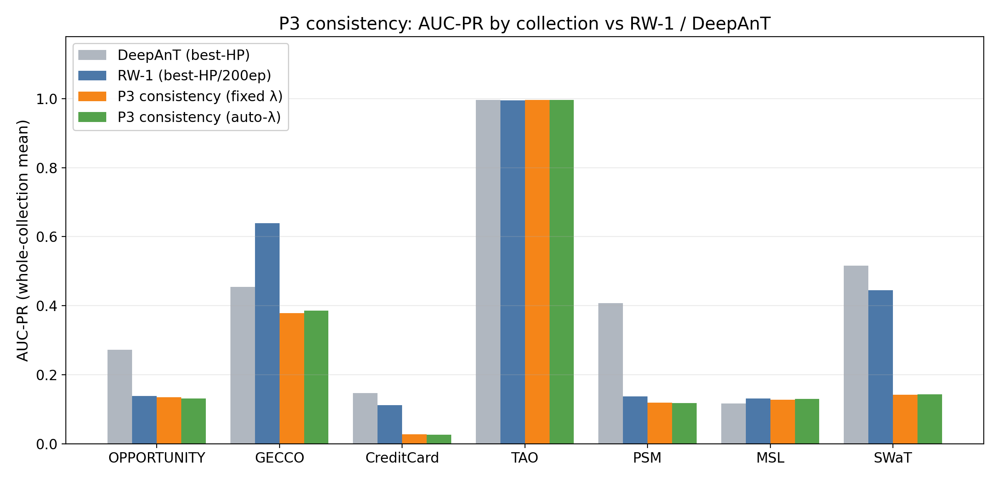
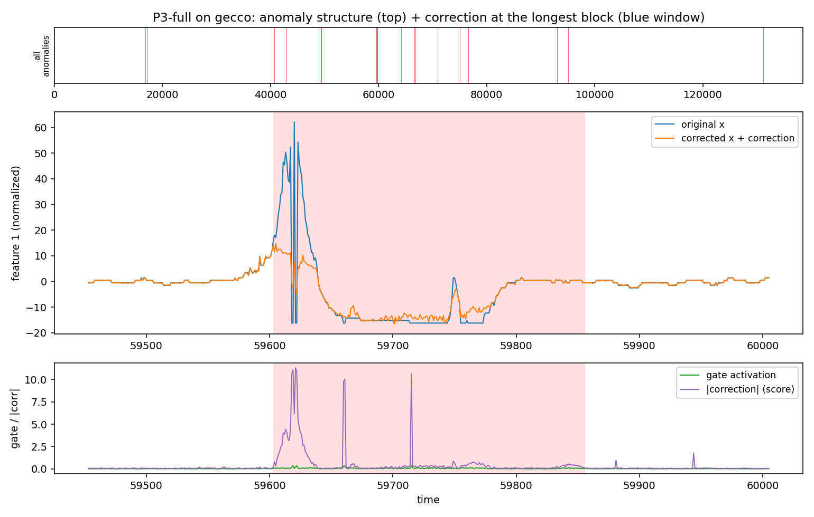
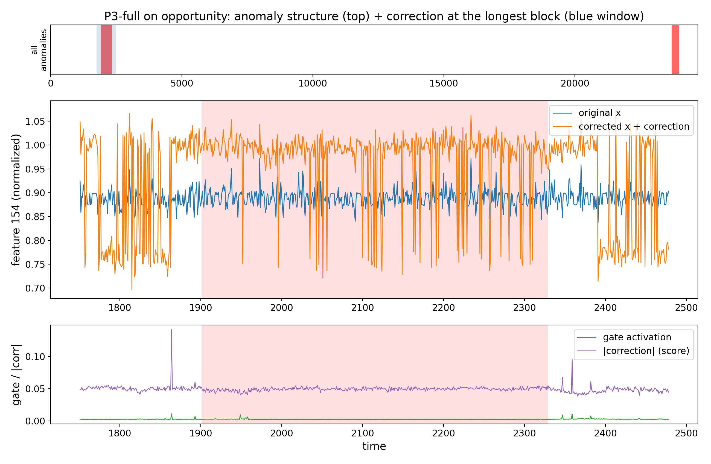
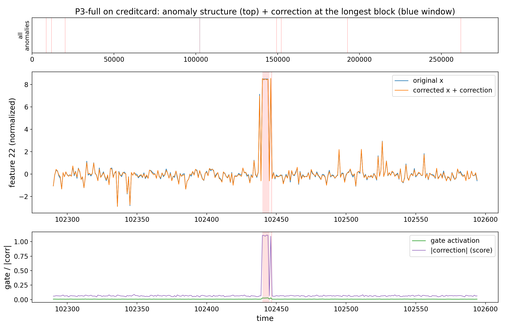
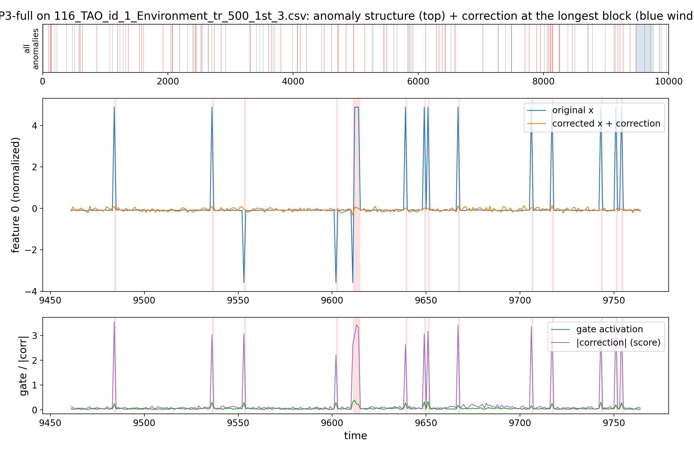
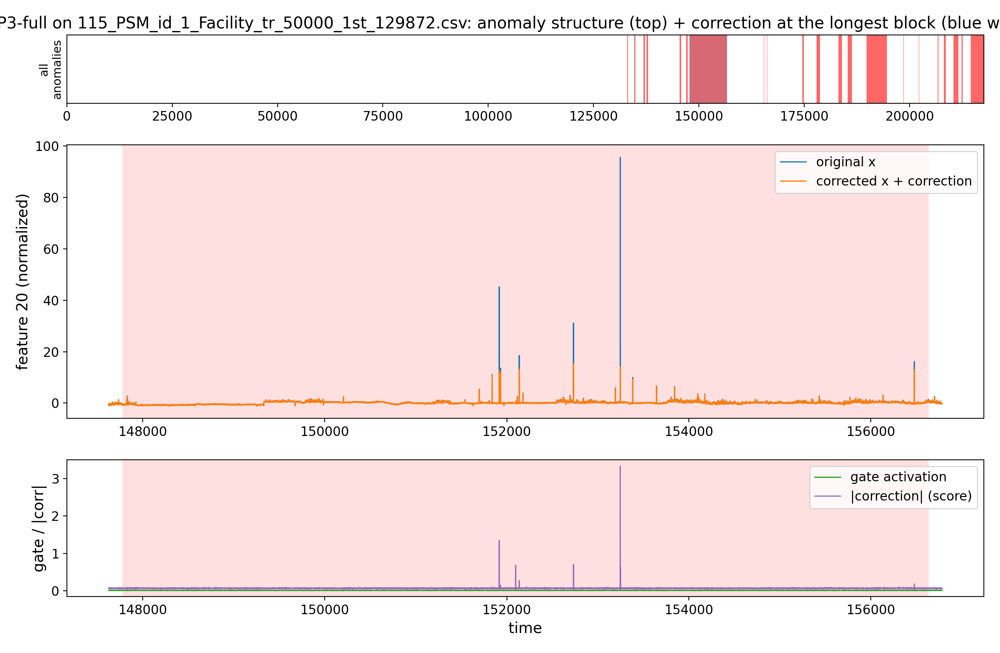
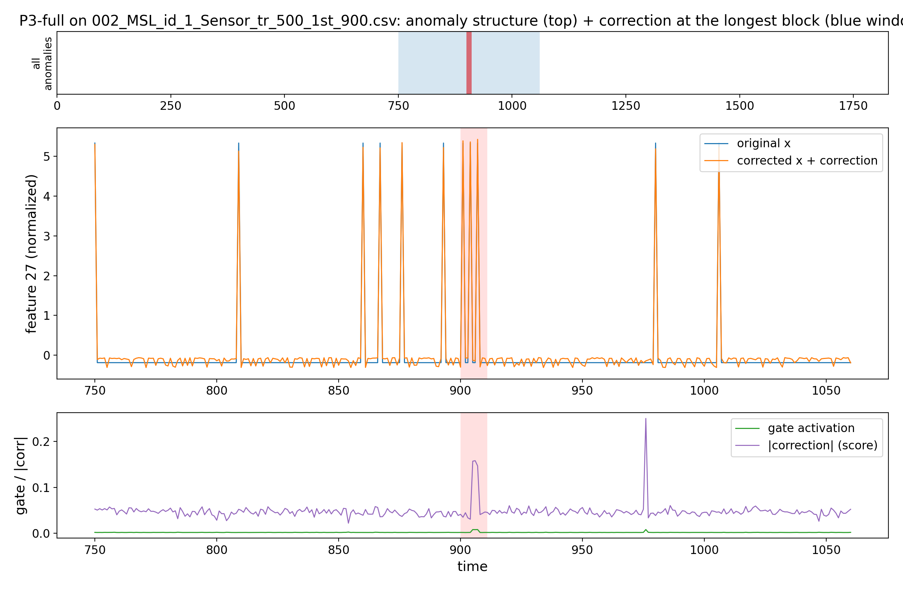
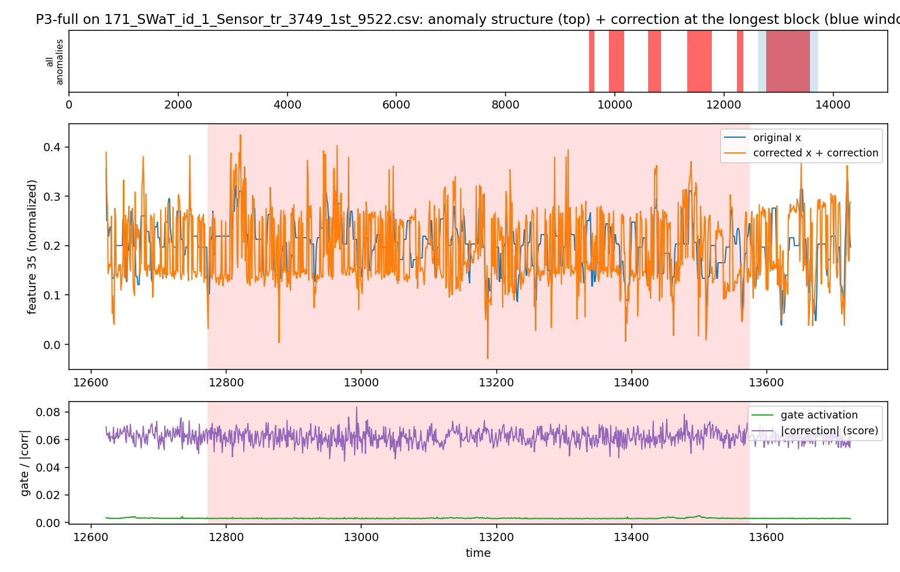

# Proposal 3 — RW-Correction-Consistency CEGAR: Results

**Result: P3 does not beat the best-HP/200ep RW-1 (0/3). Closest near-tie on OPPORTUNITY
(Δ−0.003); GECCO well below.**

## What Proposal 3 is (docx-faithful, full)
Signal = the correction's own behaviour. `d_t=mean_feat|C_t|`, `v_t=cos(ΔC^e,ΔC^{e-1})`,
`g=σ(k_d(d−τ_d)/sd)·σ(k_v(v−τ_v))`, EMA-smoothed over epochs. Drives gradient amplification
(previous-epoch gate → ScaleGrad) AND a preserve write-back `grad_C·(1−γg)`.

## Experiment settings
| group | values |
|---|---|
| training | `epochs=100`, `warmup=10` (**plain RW-1, gate OFF; gate on after**), `correction_init='neg_x'` |
| RW-1 base | `window=50`, `batch=256`, `l1_weight=0.001`, `activation=linear`, `correction_rate=0.1` |
| gate | `λ=1` (fixed) **or** `lam_mode='auto_tr'`; `gamma=0.9`, `corr_q=0.95`, `k_d=1`, `k_v=5`, `tau_v=0`, `persist_alpha=0.9` |
| variant | `full` (amplify + preserve) |
| eval | whole collection; **no fixed seed** (1 run/cell) |
| baseline | reproduction best-HP/200ep → Δ config-confounded (indicative) |

## Results — all collections (AUC-PR; fixed / auto-λ)
Top three rows = the 3 screening collections picked at the start (GECCO / OPPORTUNITY / CreditCard); bottom four = the later shape-spectrum extension. **W** = fixed beats RW-1.

| collection | shape | n | DeepAnT* | RW-1* | P3 fixed | auto-λ | Δ (fixed−RW-1) |
|---|:-:|:-:|:--:|:--:|:--:|:--:|:--:|
| GECCO | block | 1 | 0.454 | 0.639 | 0.379 | 0.386 | −0.260 |
| OPPORTUNITY | block | 8 | 0.272 | 0.138 | 0.135 | 0.131 | −0.003 |
| CreditCard | point | 1 | 0.147 | 0.111 | 0.027 | 0.026 | −0.084 |
| TAO | point | 13 | 0.996 | 0.995 | 0.996 | 0.996 | ≈0 (tie) |
| PSM | mixed | 1 | 0.407 | 0.137 | 0.118 | 0.118 | −0.019 |
| MSL | block | 16 | 0.116 | 0.131 | 0.128 | 0.130 | −0.003 |
| SWaT | block | 2 | 0.516 | 0.444 | 0.141 | 0.143 | −0.303 |

Beats RW-1 on **0/3** of the screening collections; only the trivial TAO tie on the extension (loses MSL/SWaT/PSM).
AUC-ROC (fixed): OPP 0.717, GECCO 0.841, CC 0.614.

## Correction diagnostics (thesis §8.4, fixed)

How to read (all computed per timestep in the FINAL training epoch, against the
ground-truth labels; labels are used for analysis only, never during training):

- **gate->label AUC**: ROC-AUC when the per-timestep gate activation is used as if it
  were an anomaly score. 0.5 = the gate fires randomly w.r.t. the true anomalies,
  1.0 = it fires exactly at them. Measures how well the gate LOCALIZES anomalies.
  (Gate activation of a timestep = mean gate value of the training windows whose
  prediction target is that timestep.)
- **corr@anom/norm**: mean |correction| on anomaly timesteps / mean |correction| on
  normal timesteps. Since the anomaly score IS mean |correction|, this is the score
  contrast: e.g. a value of 10 means anomalous points end up with 10x more correction
  than normal points (higher = better separation = higher AUC-PR, all else equal).
- **Overlap (prec)**: thesis Sec. 8.4 definition. A point is "high-correction" when its
  |correction| exceeds the series' own 95th percentile (tau_C). Overlap = fraction of
  high-correction points that are true anomalies (precision of the correction).
- **Coverage (recall)**: fraction of true anomaly points that are high-correction
  (recall of the correction; thesis Sec. 8.4 calls it AnomalyCoverage).

| collection | gate→label AUC | corr@anom/norm | Overlap | Coverage |
|---|:--:|:--:|:--:|:--:|
| GECCO | 0.829 | 7.51 | 0.152 | 0.610 |
| CreditCard | 0.576 | 1.70 | 0.007 | 0.213 |
| OPPORTUNITY | 0.359 | 1.10 | 0.137 | 0.167 |

## Interpretability
The consistency gate localizes reasonably on GECCO (0.83) and preserves correction there
(7.5×), but P3 still trails the residual/dual-gradient proposals; the amplify-vs-preserve
pair nets out roughly neutral. Near-ties RW-1 on opportunity.

## Decision
Does not beat tuned RW-1 → move to Proposal 4.


## Performance (AUC-PR by collection)



P3's consistency gate lands mid-pack — close to RW-1 on the low-baseline collections but well under on GECCO, and it collapses on the strong SWaT block like the others.

## Correction examples

**How to read these.** *Middle panel*: `original x` (blue) vs `corrected x = x + correction` (orange) — where the two diverge, the trained RW correction is large. *Bottom panel*: the CEGAR gate (green) and the per-step `|correction|` score (purple); the red band is the labelled anomaly. A detector scores well when both the gate and `|correction|` spike **inside** the red band and stay flat outside — that contrast is what the anomaly score (`mean|correction|`) turns into AUC-PR. The top strip shows where the zoom window sits in the whole series.

**Analysis.** The consistency gate fires moderately at anomalies; correction concentration on GECCO (≈7.5×) is lower than P1/P4/P5, consistent with its weaker score.

### Screening collections

**GECCO (block) — the win**



**OPPORTUNITY (block)**



**CreditCard (point)**



### Shape extension

**TAO (point)**



**PSM (mixed)**



**MSL (block)**



**SWaT (block)**



## Reproduce
```bash
source /ocean/projects/cis260190p/yhwang2/xlstmad_env/bin/activate
cd /ocean/projects/cis260190p/yhwang2/rwml-autocegar
sbatch experiments/proposals/runs/submit_p3_coll.sh
python experiments/proposals/aggregate_collection.py --proposal 3
```
