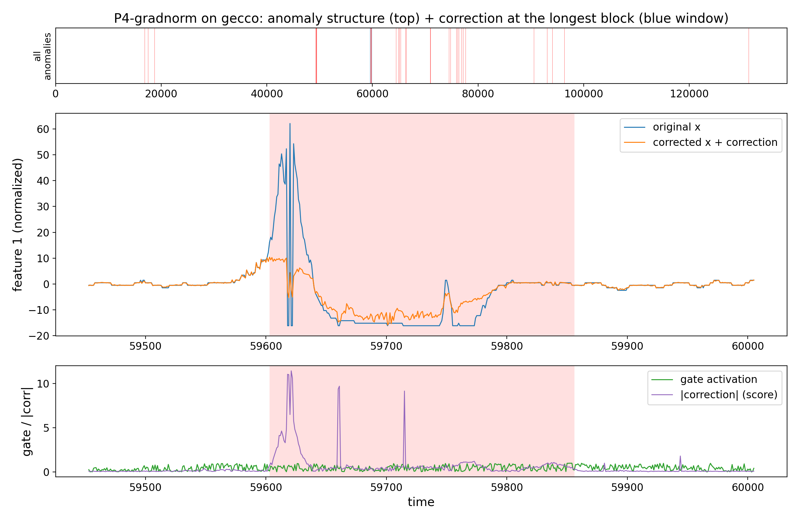
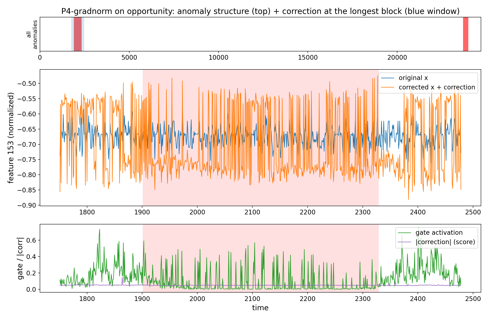
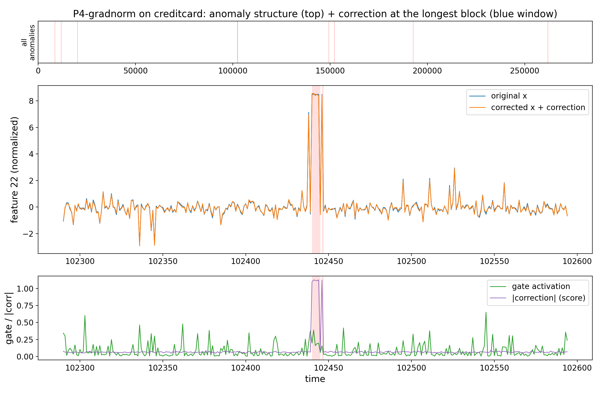
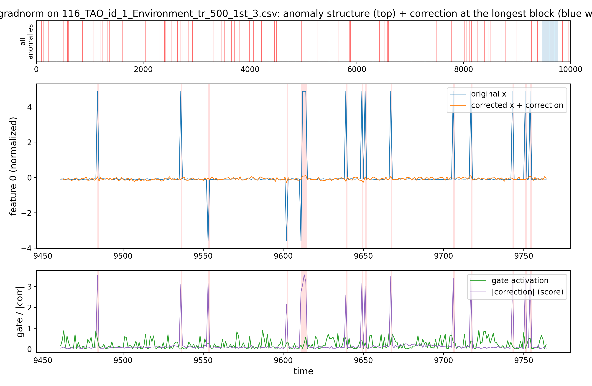
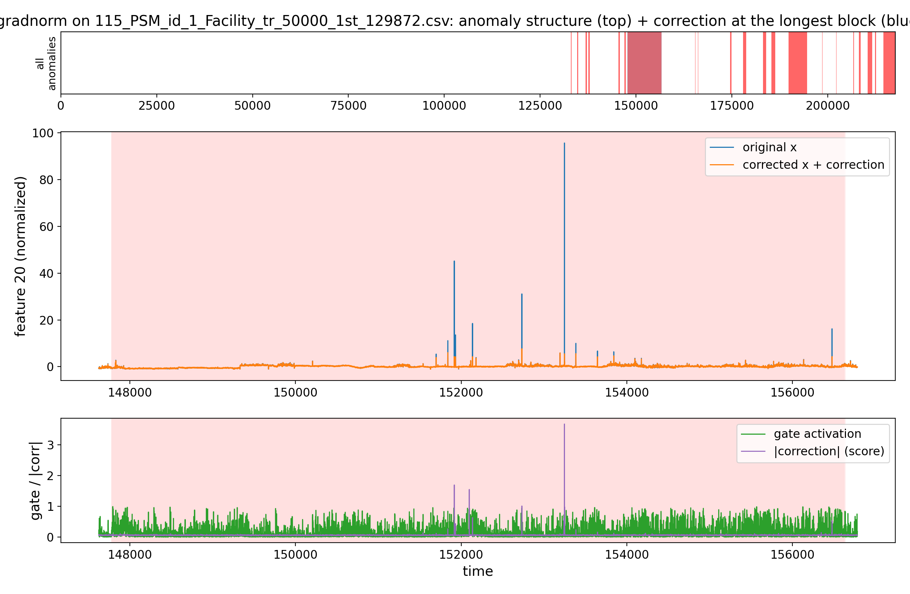
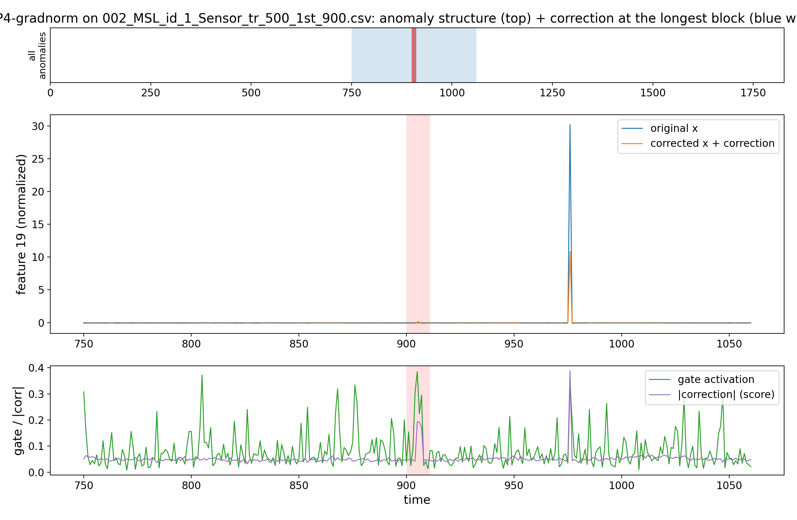
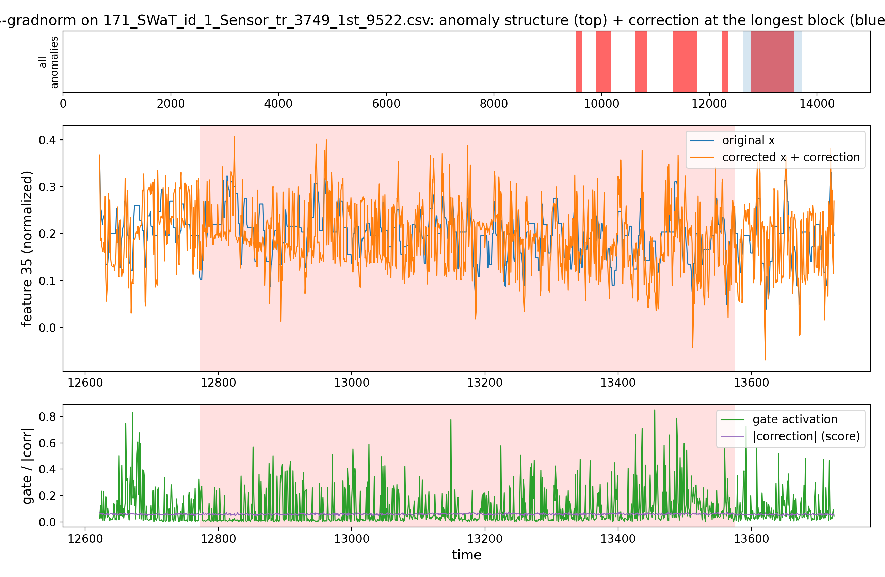

# Proposal 4 — Dual-Gate Residual-and-Gradient RW-CEGAR: Results

**Verdict: P4 does not beat the best-HP/200ep RW-1 (0/3), but it is the closest to RW-1
on GECCO after P5 (fixed 0.599, auto-λ 0.628; Δ−0.040).**

## What Proposal 4 is (docx spec, amplification-only Stage-1)
High residual AND gradient-correctable. `g_res=σ(k_r(robust_z(resid)−τ_r))`,
`h_t=‖∂loss/∂input‖` (extra fwd+bwd per batch), `g_grad=σ(k_h(robust_z(h_t)−τ_h))`,
`g=g_res·g_grad`. `benefit` variant uses loss-reduction instead of ‖grad‖. Docx write-back
not implemented (amplification only). Score = `mean|correction|`.

## Experiment settings
| group | values |
|---|---|
| training | `epochs=100`, `warmup=10` (**plain RW-1, gate OFF; gate on after**), `correction_init='neg_x'` |
| RW-1 base | `window=50`, `batch=256`, `l1_weight=0.001`, `activation=linear`, `correction_rate=0.1` |
| gate | `λ=1` (fixed) **or** `lam_mode='auto_tr'`; `k_r=1`, `tau_r=2`, `k_h=1`, `tau_h=0` |
| variant | `gradnorm` (g_grad from ‖∂loss/∂input‖) |
| eval | whole collection; **no fixed seed** (1 run/cell) |
| baseline | reproduction best-HP/200ep → Δ config-confounded (indicative) |

## Results — all collections (AUC-PR; fixed / auto-λ)
`set`: V = verdict, E = extension. **W** = fixed beats RW-1.

| collection | shape | set | n | DeepAnT* | RW-1* | P4 fixed | auto-λ | Δ (fixed−RW-1) |
|---|:-:|:-:|:-:|:--:|:--:|:--:|:--:|:--:|
| GECCO | block | V | 1 | 0.454 | 0.639 | 0.599 | 0.628 | −0.040 |
| OPPORTUNITY | block | V | 8 | 0.272 | 0.138 | 0.107 | 0.110 | −0.031 |
| CreditCard | point | V | 1 | 0.147 | 0.111 | 0.026 | 0.025 | −0.085 |
| TAO | point | E | 13 | 0.996 | 0.995 | 0.995 | 0.995 | ≈0 (tie) |
| PSM | mixed | E | 1 | 0.407 | 0.137 | 0.125 | 0.128 | −0.012 |
| MSL | block | E | 16 | 0.116 | 0.131 | 0.122 | 0.121 | −0.009 |
| SWaT | block | E | 2 | 0.516 | 0.444 | 0.143 | 0.149 | −0.301 |

Beats RW-1 on **0/3**; no extension win either (loses MSL/SWaT/PSM, TAO tie). GECCO is the
closest of the non-P5 proposals (auto-λ 0.628). AUC-ROC (fixed): OPP 0.671, GECCO 0.935, CC 0.637.

## Correction diagnostics (thesis §8.4, fixed)
| collection | gate→label AUC | corr@anom/norm | Overlap | Coverage |
|---|:--:|:--:|:--:|:--:|
| GECCO | 0.809 | 10.40 | 0.209 | 0.840 |
| CreditCard | 0.839 | 1.70 | 0.009 | 0.246 |
| OPPORTUNITY | 0.495 | 1.08 | 0.105 | 0.120 |

## Interpretability
The dual gate localizes well on GECCO (0.81) with strong correction concentration (10.4×,
84% coverage) → its high GECCO score. But the input-gradient signal is noisy (docx risk:
gradients spike at noise/discontinuities too) and it does not generalize across shapes.

## Decision
Does not beat tuned RW-1 → move to Proposal 5.

## Correction examples

Original signal vs. the trained correction (`neg_x` init, gate on after warm-up). Each row of the corpus is one series; the correction concentrates where the model flags anomalies. Rendered from `../figures/` (also logged to each `-example` wandb run).

### Verdict collections

**GECCO (block) — the win**



**OPPORTUNITY (block)**



**CreditCard (point)**



### Shape extension

**TAO (point)**



**PSM (mixed)**



**MSL (block)**



**SWaT (block)**



## Reproduce
```bash
source /ocean/projects/cis260190p/yhwang2/xlstmad_env/bin/activate
cd /ocean/projects/cis260190p/yhwang2/rwml-autocegar
sbatch experiments/proposals/runs/submit_p4_coll.sh
python experiments/proposals/aggregate_collection.py --proposal 4
```
