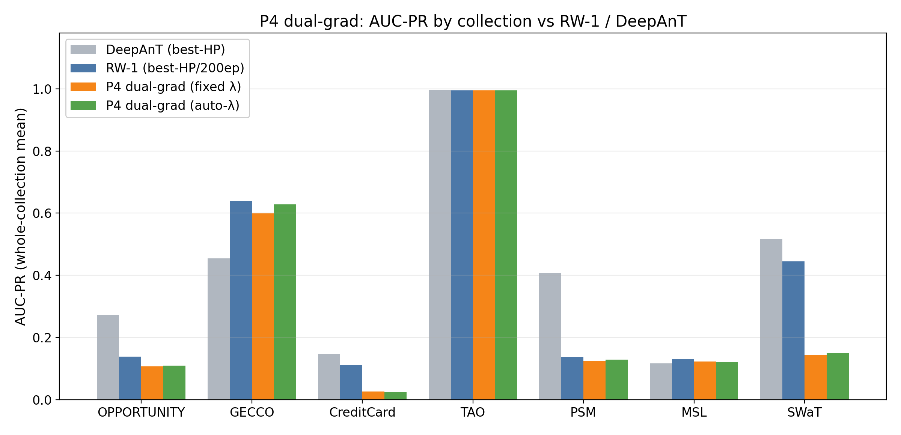

# Proposal 4 — Dual-Gate Residual-and-Gradient RW-CEGAR: Results

**Result: P4 does not beat the best-HP/200ep RW-1 (0/3), but it is the closest to RW-1
on GECCO after P5 (fixed 0.599, auto-λ 0.628; Δ−0.040).**

## What Proposal 4 is (docx spec, amplification-only Stage-1)
High residual AND gradient-correctable. `g_res=σ(k_r(robust_z(resid)−τ_r))`,
`h_t=‖∂loss/∂input‖` (extra fwd+bwd per batch), `g_grad=σ(k_h(robust_z(h_t)−τ_h))`,
`g=g_res·g_grad`. `benefit` variant uses loss-reduction instead of ‖grad‖. Score =
`mean|correction|`. *(Screening was amplification-only; the docx correctable-point write-back
was implemented later as the `gradnorm_wb` variant — see the Update section at the bottom.)*

## Experiment settings
| group | values |
|---|---|
| training | `epochs=100`, `warmup=10` (**plain RW-1, gate OFF; gate on after**), `correction_init='neg_x'` |
| RW-1 base | `window=50`, `batch=256`, `l1_weight=0.001`, `activation=linear`, `correction_rate=0.1` |
| gate | `λ=1` (fixed) **or** `lam_mode='auto_tr'`; `k_r=1`, `tau_r=2`, `k_h=1`, `tau_h=0` |
| variant | `gradnorm` (g_grad from ‖∂loss/∂input‖) |
| eval | whole collection; **no fixed seed** (1 run/cell) |
| baseline | reproduction best-HP/200ep → Δ config-confounded (indicative) |

## Results — all collections (AUC-PR; fixed / auto-λ)
Top three rows = the 3 screening collections picked at the start (GECCO / OPPORTUNITY / CreditCard); bottom four = the later shape-spectrum extension. **W** = fixed beats RW-1.

| collection | shape | n | DeepAnT* | RW-1* | P4 fixed | auto-λ | Δ (fixed−RW-1) |
|---|:-:|:-:|:--:|:--:|:--:|:--:|:--:|
| GECCO | block | 1 | 0.454 | 0.639 | 0.599 | 0.628 | −0.040 |
| OPPORTUNITY | block | 8 | 0.272 | 0.138 | 0.107 | 0.110 | −0.031 |
| CreditCard | point | 1 | 0.147 | 0.111 | 0.026 | 0.025 | −0.085 |
| TAO | point | 13 | 0.996 | 0.995 | 0.995 | 0.995 | ≈0 (tie) |
| PSM | mixed | 1 | 0.407 | 0.137 | 0.125 | 0.128 | −0.012 |
| MSL | block | 16 | 0.116 | 0.131 | 0.122 | 0.121 | −0.009 |
| SWaT | block | 2 | 0.516 | 0.444 | 0.143 | 0.149 | −0.301 |

Beats RW-1 on **0/3**; no extension win either (loses MSL/SWaT/PSM, TAO tie). GECCO is the
closest of the non-P5 proposals (auto-λ 0.628). AUC-ROC (fixed): OPP 0.671, GECCO 0.935, CC 0.637.

## Correction diagnostics (thesis §8.4, fixed)

How to read (all computed per timestep in the FINAL training epoch, against the
ground-truth labels; labels are used for analysis only, never during training):

- **gate->label AUC**: ROC-AUC when the per-timestep gate activation is used as if it
  were an anomaly score. 0.5 = the gate fires randomly w.r.t. the true anomalies,
  1.0 = it fires exactly at them. Measures how well the gate LOCALIZES anomalies.
  (Gate activation of a timestep = mean gate value of the training windows whose
  prediction target is that timestep.)
- **corr@anom/norm**: mean |correction| on anomaly timesteps / mean |correction| on
  normal timesteps. Since the anomaly score IS mean |correction|, this is the score
  contrast: e.g. a value of 10 means anomalous points end up with 10x more correction
  than normal points (higher = better separation = higher AUC-PR, all else equal).
- **Overlap (prec)**: thesis Sec. 8.4 definition. A point is "high-correction" when its
  |correction| exceeds the series' own 95th percentile (tau_C). Overlap = fraction of
  high-correction points that are true anomalies (precision of the correction).
- **Coverage (recall)**: fraction of true anomaly points that are high-correction
  (recall of the correction; thesis Sec. 8.4 calls it AnomalyCoverage).

| collection | gate→label AUC | corr@anom/norm | Overlap | Coverage |
|---|:--:|:--:|:--:|:--:|
| GECCO | 0.809 | 10.40 | 0.209 | 0.840 |
| CreditCard | 0.839 | 1.70 | 0.009 | 0.246 |
| OPPORTUNITY | 0.495 | 1.08 | 0.105 | 0.120 |

## Interpretability
The dual gate localizes well on GECCO (0.81) with strong correction concentration (10.4×,
84% coverage) → its high GECCO score. But the input-gradient signal is noisy (docx risk:
gradients spike at noise/discontinuities too) and it does not generalize across shapes.

## Decision
Does not beat tuned RW-1 → move to Proposal 5.


## Performance (AUC-PR by collection)



P4's dual (residual × input-gradient) gate is the runner-up on GECCO — auto-λ comes close to RW-1 — but does not clear it; elsewhere it tracks the other gates.

## Correction examples

**How to read these.** *Middle panel*: `original x` (blue) vs `corrected x = x + correction` (orange) — where the two diverge, the trained RW correction is large. *Bottom panel*: the CEGAR gate (green) and the per-step `|correction|` score (purple); the red band is the labelled anomaly. A detector scores well when both the gate and `|correction|` spike **inside** the red band and stay flat outside — that contrast is what the anomaly score (`mean|correction|`) turns into AUC-PR. The top strip shows where the zoom window sits in the whole series.

**Analysis.** The dual residual×gradient gate localizes the GECCO anomaly well (gate→label ≈0.81) and concentrates correction (≈10.4×) — the second strongest — but still lands under the tuned RW-1.

### Screening collections

**GECCO (block) — the win**


**OPPORTUNITY (block)**


**CreditCard (point)**


### Shape extension

**TAO (point)**


**PSM (mixed)**


**MSL (block)**


**SWaT (block)**


## Reproduce
```bash
source /ocean/projects/cis260190p/yhwang2/xlstmad_env/bin/activate
cd /ocean/projects/cis260190p/yhwang2/rwml-autocegar
sbatch experiments/proposals/runs/submit_p4_coll.sh
python experiments/proposals/aggregate_collection.py --proposal 4
```

## Update — cr × l1 re-ranking (post-screening)
The table above is the **initial fail-fast screening** (fixed `correction_rate=0.1`, 100ep,
gate on after warm-up, indicative baseline). A later sweep re-ran P4 over
`cr∈{0.001,0.01,0.1} × l1∈{0.001,0.01,0.1,1.0}` at 200ep (in the now-implemented `gradnorm_wb` **write-back** variant — the docx correctable-point write-back that was *not* implemented during screening). `correction_rate` turned out to
be a dominant, collection-dependent knob that the fixed 0.1 mis-set for most collections.

**Oracle** (per-series best over the grid, collection mean — over-optimistic upper bound, vs our
cr=0.1-fixed reproduction RW-1):

| method | GECCO | OPP | CC | TAO | PSM | MSL | SWaT | MEAN(7) | wins |
|---|--|--|--|--|--|--|--|--|--|
| P4-dualgrad(wb) | 0.574 | 0.530 | 0.173 | 1.000 | 0.172 | 0.187 | 0.498 | **0.448** | 6/7 |

**Deployable** (one fixed config `cr0.001/l10.1`) vs **Baldo thesis RW 1** (Table 6.2, properly tuned):

| method | GECCO | OPP | CC | TAO | PSM | MSL | SWaT | MEAN(7) | wins |
|---|--|--|--|--|--|--|--|--|--|
| thesis RW 1 | 0.621 | 0.059 | 0.173 | 1.000 | 0.238 | 0.086 | 0.227 | 0.343 | — |
| P4-dualgrad(wb) | 0.402 | 0.520 | 0.172 | 1.000 | 0.155 | 0.120 | 0.497 | **0.409** | 3/7 |

**Takeaway:** the oracle 6/7 collapses to **3/7** under one deployable config,
and the remaining wins (OPPORTUNITY/SWaT) are protocol-confounded (same RW 1: thesis SWaT 0.227
vs our gate-off reproduction 0.444). So this gate's own contribution is **≈ 0** — all five
proposals cluster at 0.41–0.43. See `SUMMARY.md` and `proposal5_tune_results.md` for the full
P1–P5 comparison; figures `figures/crtune_rerank.png` + `figures/crtune_fixed_vs_thesis.png`.
