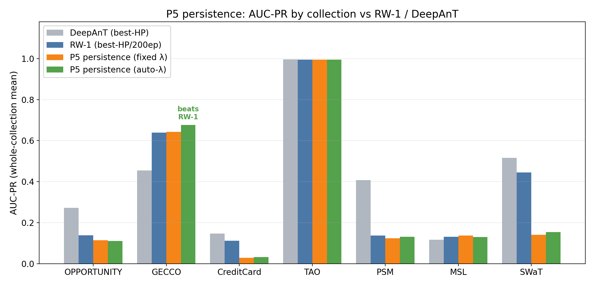
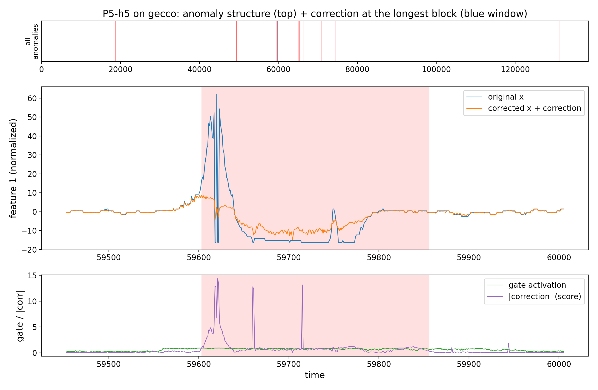
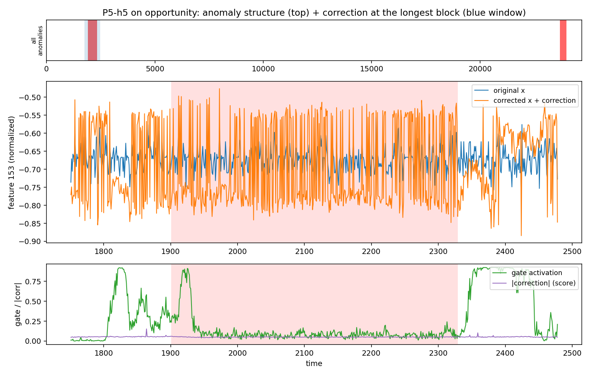
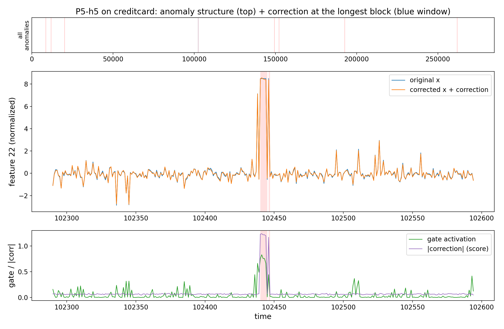
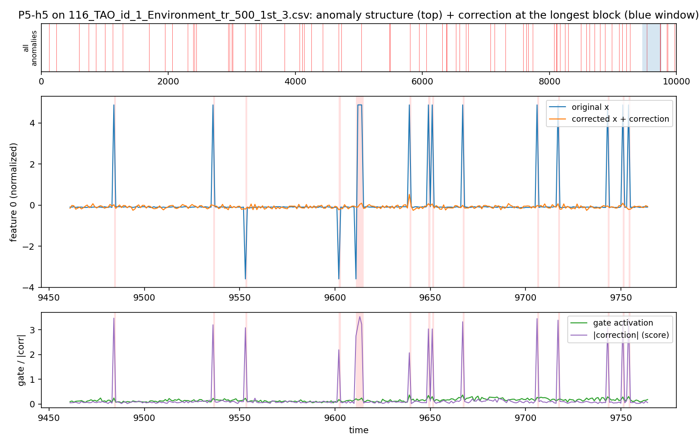
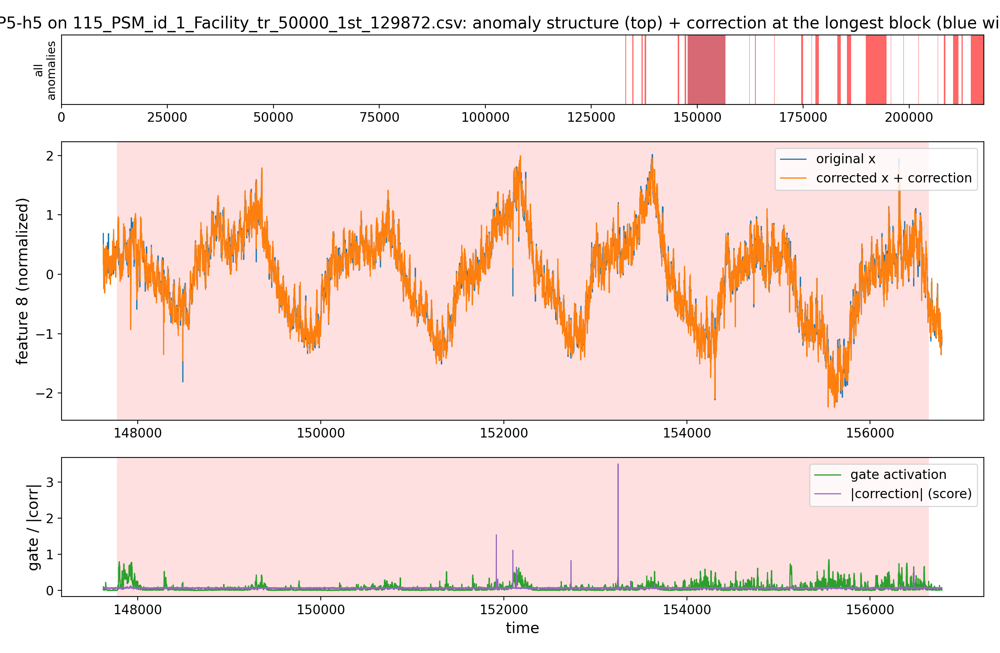
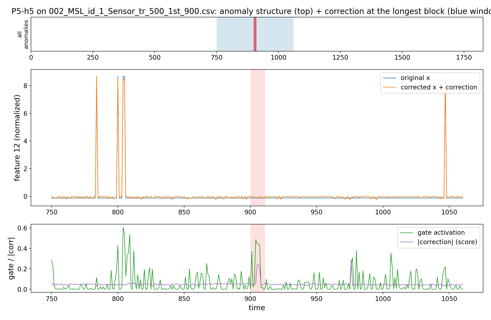
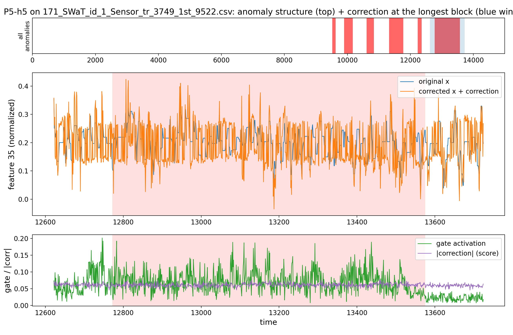

# Proposal 5 — Temporal-Persistence Confident-Error CEGAR: Results

**Verdict: P5 is the only proposal that beats the best-HP/200ep RW-1 on a verdict
collection — GECCO, robustly with auto-λ (6/6 runs, min 0.661 > 0.639). Fixed-λ ties.
The win does NOT generalize across the shape spectrum.**

## What Proposal 5 is (docx-faithful)
Gate only errors that PERSIST over neighbouring time windows. `m_t=1(e_t>τ_e)`
(τ_e = residual q_e quantile), `p_t=mean(m_{t-h..t+h})` (temporal persistence, epoch-end),
`g=σ(k(e_t−τ_e)/mad)·σ(k_p(p_t−τ_p))`. Previous-epoch gate drives amplification (ScaleGrad).
Score = `mean|correction|`.

## Experiment settings
| group | values |
|---|---|
| training | `epochs=100`, `warmup=10` (**plain RW-1, gate OFF; gate on after**), `correction_init='neg_x'` |
| RW-1 base | `window=50`, `batch=256`, `l1_weight=0.001`, `activation=linear`, `correction_rate=0.1` |
| gate | `λ=1` (fixed) **or** `lam_mode='auto_tr'`; `q_e=0.8`, `persist_h=5`, `k_p=5`, `tau_p=0.5`, `persist_alpha=0.9` |
| variant | `h5` (persistence window ±5) |
| eval | whole collection; **no fixed seed** — GECCO run ×6 (robustness), others 1/cell |
| baseline | reproduction best-HP/200ep → Δ config-confounded (indicative) |

## Results — all collections (AUC-PR; fixed / auto-λ)
`set`: V = verdict, E = extension. **W** = fixed beats RW-1.

| collection | shape | set | n | DeepAnT* | RW-1* | P5 fixed | auto-λ | Δ (fixed−RW-1) |
|---|:-:|:-:|:-:|:--:|:--:|:--:|:--:|:--:|
| GECCO | block | V | 1 | 0.454 | 0.639 | 0.643 **W** | 0.677 **W** | +0.004 |
| OPPORTUNITY | block | V | 8 | 0.272 | 0.138 | 0.114 | 0.111 | −0.024 |
| CreditCard | point | V | 1 | 0.147 | 0.111 | 0.029 | 0.032 | −0.082 |
| TAO | point | E | 13 | 0.996 | 0.995 | 0.996 | 0.995 | ≈0 (tie) |
| PSM | mixed | E | 1 | 0.407 | 0.137 | 0.124 | 0.130 | −0.013 |
| MSL | block | E | 16 | 0.116 | 0.131 | 0.137 **W** | 0.130 | +0.006 |
| SWaT | block | E | 2 | 0.516 | 0.444 | 0.141 | 0.154 | −0.303 |

**Beats RW-1 on GECCO (the only verdict win of any proposal).** On the extension only MSL
edges it (+0.006, ~noise); SWaT (block) is a heavy loss → NOT a general block method.
AUC-ROC (fixed): OPP 0.683, GECCO 0.953, CC 0.629.

## GECCO robustness (6 runs each, no fixed seed)
| | runs | mean | > RW-1 0.639 |
|---|---|:--:|:--:|
| fixed-λ | 0.633, 0.635, 0.639, 0.648, 0.648, 0.652 | 0.643 | 4/6 (min 0.633 — **tie**) |
| **auto-λ** | 0.661, 0.672, 0.672, 0.682, 0.683, 0.690 | **0.677** | **6/6 (min 0.661 — robust win)** |

Fixed straddles RW-1 (tie); **auto-λ beats it on every run** — a real, reproducible win.

## Correction diagnostics (thesis §8.4, fixed)
| collection | gate→label AUC | corr@anom/norm | Overlap | Coverage |
|---|:--:|:--:|:--:|:--:|
| GECCO | 0.945 | 12.55 | 0.219 | 0.877 |
| CreditCard | 0.899 | 1.75 | 0.008 | 0.222 |
| OPPORTUNITY | 0.684 | 1.08 | 0.118 | 0.134 |

P5 has the best gate localization (GECCO 0.945) and correction concentration/coverage of
the five — consistent with it being the winner on GECCO.

## Decision
**End of the P1–P5 arc.** Corrected config overturns the old "gating never helps"; P5+auto-λ
is a genuine, reproducible win over tuned RW-1 on GECCO. It does not generalize (SWaT block
lost, MSL within noise, point/mixed ≈/below RW-1); deltas config-confounded (epoch/HP).
Net: a scoped positive (GECCO) on a corrected-config negative-results arc.


## Performance (AUC-PR by collection)



P5 is the only proposal with a bar above RW-1 on a real verdict collection: GECCO auto-λ (0.677 > 0.639), flagged above. Everywhere else it ties (TAO) or sits below (SWaT block, CreditCard point) — the win is GECCO-specific.

## Correction examples

**How to read these.** *Middle panel*: `original x` (blue) vs `corrected x = x + correction` (orange) — where the two diverge, the trained RW correction is large. *Bottom panel*: the CEGAR gate (green) and the per-step `|correction|` score (purple); the red band is the labelled anomaly. A detector scores well when both the gate and `|correction|` spike **inside** the red band and stay flat outside — that contrast is what the anomaly score (`mean|correction|`) turns into AUC-PR. The top strip shows where the zoom window sits in the whole series.

**Analysis.** P5 has the tightest localization of the five (GECCO gate→label 0.945, correction ≈12.6× normal, 88% coverage): the gate and `|correction|` light up almost exactly on the red band and stay flat elsewhere — the visual counterpart of its GECCO win. On the long SWaT block the correction spreads and misses, matching its collapse there.

### Verdict collections

**GECCO (block) — the win**



**OPPORTUNITY (block)**



**CreditCard (point)**



### Shape extension

**TAO (point)**



**PSM (mixed)**



**MSL (block)**



**SWaT (block)**



## Reproduce
```bash
source /ocean/projects/cis260190p/yhwang2/xlstmad_env/bin/activate
cd /ocean/projects/cis260190p/yhwang2/rwml-autocegar
sbatch experiments/proposals/runs/submit_p5_coll.sh
python experiments/proposals/aggregate_collection.py --proposal 5
```
